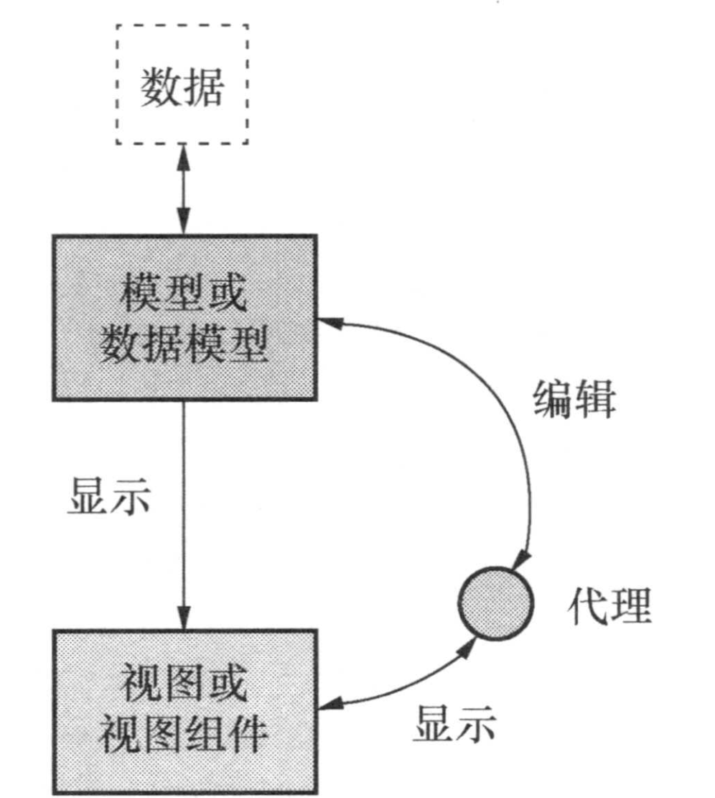
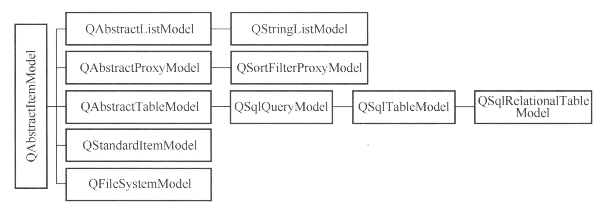
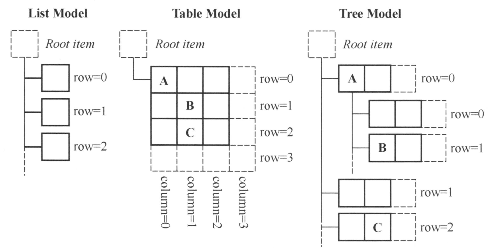
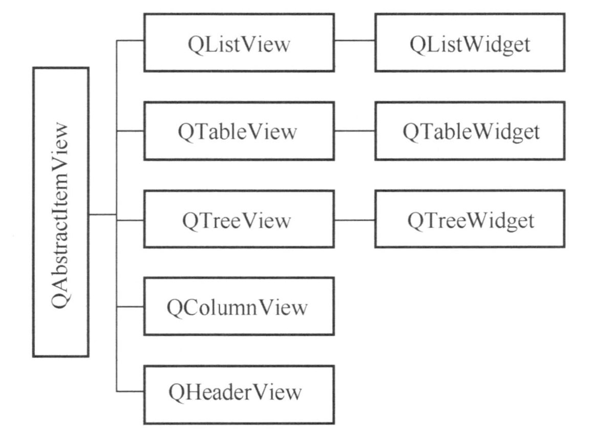
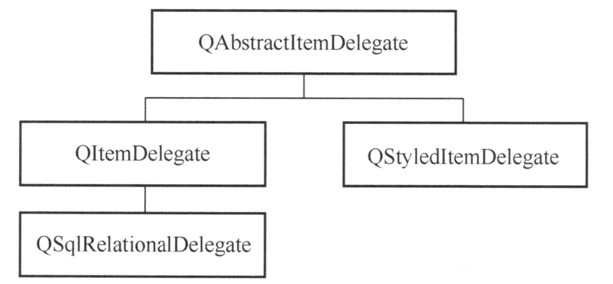

# Qt Model/View 结构

- [Model/View Tutorial - Qt Documentation](https://doc.qt.io/qt-6/modelview.html)
- [Model/View Programming - Qt Documentation](https://doc.qt.io/qt-6/model-view-programming.html)

## 原理

Widget 拿取数据有两种方法：

- 在内部使用容器保存数据
- 不在内部保存数据，而是从标准化的外部接口获取数据

后者能够避免数据冗余，在大型程序中更为常见。这种设计模式称为 Model/View。

Qt 设计基于下图所示的 Model/View 结构：



它们之间的相互作用机制如下：

- 源数据发生变化时，Model 发射信号通知 View。
- 用户在界面上操作数据时，View 发射信号表示 Command。
- 数据被编辑时，Delegate 发射信号告知 Model 和 View 编辑器的状态。

如果要适配课上所说的 MVVM 模型，只需在 View 和 Model 之间再创建一层 Proxy Model 即可。

## Model 类

Qt 提供以下 Model 类：



### item

Model 中数据的基本单元是 item，它具有 row、column 和 parent item 三个参数。通过这三个参数，可以构造 List、Table、Tree 等组织形式的 Model。



### index

`QAbstractItemModel` 的子类都以表格的层次结构表示数据，View 通过这种规则来存取 Model 中的数据。`QModelIndex` 表示 Model 索引，提供一个临时指针，用来通过 Model 提取或修改数据，如下所示：

```cpp
// QModelIndex() 表示 root item
QModelIndex index = model->index(0, 0, QModelIndex());
```

### role

一个 item 具有多种 role，用于告知视图和代理如何显示数据。比如：

- `Qt::DisplayRole`：（标准）在 View 中显示的字符串
- `Qt::ToolTipRole`：鼠标悬停时显示的字符串
- `Qt::UserRole`：用户自定义的 role，用于在 Model 中存储额外的数据

role 是 `Qt::ItemDataRole` 枚举类型。存取 item 的数据时都需要指定 role：

```cpp
// data 函数的签名
QVariant QStandardItem::date(int role = Qt::UserRole + 1) const
// setData 函数的签名
void QStandardItem::setData(const QVariant &value, int role = Qt::UserRole + 1)
```

## View 类

Qt 提供以下 `QAbstractItemView` 类：



调用 View 的 `setModel()` 函数可以将其关联到一个 Model。在 View 上的修改自动保存到关联的 Model。

## Delegate 类

Delegate 在 View 上为编辑数据提供编辑器。

Qt 提供 `QAbstractItemDelegate` 作为所有代理类的基类，其子类 `QStyleItemDelegate` 是 View 默认使用的代理类，一般从它继承创建自定义代理类。



## ProxyModel 类

- `QAbstractProxyModel`：继承自 `QAbstractItemModel`
    - `QIdentityProxyModel`：转换内容而不改变结构
    - `QSortFilterProxyModel`：排序和过滤

## QDataWidgetMapper 类

Qt 提供的三种 View 均继承自 `QAbstractItemView`，而 `QAbstractItemView` 又继承自 `QAbstractScrollArea`。很多时候我们设计的 Widget 并不能设计为 `QAbstractItemView` 的子类，这时我们可以使用 `QDataWidgetMapper`。

`QDataWidgetMapper` 是一个用于将 Model 中的数据映射到 Widget 的类。它可以将 Model 中的数据映射到 Widget 的属性，也可以将 Widget 的属性映射到 Model 中。

## 详解

Qt 文档很多函数细节没有讲清楚，还是得看源码。

### QStyledItemDelegate

- `setModelData`：从 editor 的 userProperty 中获取数据，然后调用 Model 的 `setData` 函数写入 `EditRole` 数据

    ```cpp
    void QStyledItemDelegate::setModelData(QWidget *editor,
                                    QAbstractItemModel *model,
                                    const QModelIndex &index) const
    {
        Q_D(const QStyledItemDelegate);
        Q_ASSERT(model);
        Q_ASSERT(editor);
        QByteArray n = editor->metaObject()->userProperty().name();
        if (n.isEmpty())
            n = d->editorFactory()->valuePropertyName(
                model->data(index, Qt::EditRole).userType());
        if (!n.isEmpty())
            model->setData(index, editor->property(n), Qt::EditRole);
    }
    ```

- `setEditorData`：直接从 `index` 获取 `EditRole` 数据，然后写入 editor 的 userProperty

    ```cpp
    void QStyledItemDelegate::setEditorData(QWidget *editor, const QModelIndex &index) const
    {
        QVariant v = index.data(Qt::EditRole);
        QByteArray n = editor->metaObject()->userProperty().name();

        if (!n.isEmpty()) {
            if (!v.isValid())
                v = QVariant(editor->property(n).metaType());
            editor->setProperty(n, v);
        }
    }
    ```

在实现自己的 Delegate 时，主要就是覆盖上面两个函数，实现自己的数据读写逻辑。

### QDataWidgetMapper

- `addMapping`：本质是将 delegate 的事件过滤器安装到 widget 上

    ```cpp
    void QDataWidgetMapper::addMapping(QWidget *widget, int section, const QByteArray &propertyName)
    {
        Q_D(QDataWidgetMapper);

        removeMapping(widget);
        d->widgetMap.push_back({widget, section, d->indexAt(section), propertyName});
        widget->installEventFilter(d->delegate);
    }
    ```

    默认情况下安装的是 `QStyledItemDelegate`，它支持 Tab、Backtab、Enter、Return、Esc 几类事件。

- `submit`：调用 Model 的 `submit` 函数

    ```cpp
    bool QDataWidgetMapper::submit()
    {
        Q_D(QDataWidgetMapper);

        for (auto &e : d->widgetMap) {
            if (!d->commit(e))
                return false;
        }

        return d->model->submit();
    }
    ```
