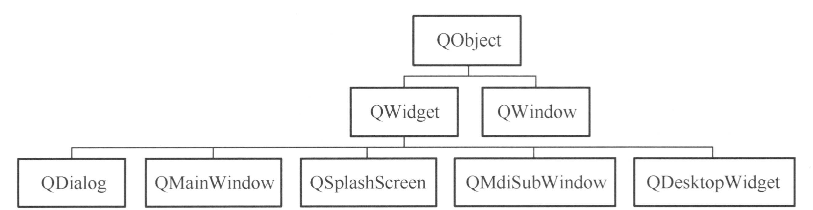

# Qt 窗体和界面组件设计

## Qt 窗体

Qt 窗体的继承关系如下图所示：



常用的窗体如下：

- `QWidget`：作为独立窗口，或指定父容器后作为父容器的内部组件。
- `QDialog`：对话框，独立窗口。
- `QMainWindows`：主窗口，一般以独立窗口显示。
- `QSplashScreen`：作为程序启动时的窗口（登录界面等），没有边框。

### QWidget 接口

- 属性设置

```cpp
// Attribute
// API
void QWidget::setAttribute(Qt::WidgetAttribute attribute, bool on = true)
// 属性
Qt::WA_DeleteOnClose

// Flag
// API
void QWidget::setWindowFlags(Qt::WindowFlags flags)
void QWidget::setWindowFlag(Qt::WindowType flag, bool on = true)
// 属性
// - 窗体类型
Qt::Widget
Qt::Window
Qt::Dialog
Qt::Popup
Qt::Tool
Qt::SplashScreen
Qt::Desktop
Qt::SubWindow
// - 显示效果
Qt::FramelessWindowHint
// - 外观
Qt::CustomizeWindowHint
Qt::WindowTitleHint
Qt::WindowSystemMenuHint
Qt::WindowMinimizeButtonHint
Qt::WindowMaximizeButtonHint
Qt::WindowCloseButtonHint
Qt::WindowContextHelpButtonHint
Qt::WindowStaysOnTopHint
Qt::WindowTransparentForInput

// State
// API
void QWidget::setWindowState(Qt::WindowStates windowState)
// 属性
Qt::WindowNoState
Qt::WindowMinimized
Qt::WindowMaximized
Qt::WindowFullScreen
Qt::WindowActive
```

### 多窗体设计

下面的代码片段设计 `MyMainWindow`，点击其中的按键打开 `MySubWindow`：

```cpp
MyMainWindow::MyMainWindow(QWidget *parent)
    : QMainWindow(parent)
{
    initUI();
    initConnect();
}
void MyMainWindow::initUI()
{
    button = new QPushButton("Open Sub Window", this);
    subWindow = nullptr;
}
void MyMainWindow::initConnect()
{
    connect(button, &QPushButton::clicked, this, &MyMainWindow::onButtonClicked);
}
void MyMainWindow::onButtonClicked()
{
    subWindow = new MySubWindow(this);
    subWindow->setAttribute(Qt::WA_DeleteOnClose);
    subWindow->setWindowFlag(Qt::Window, true);
    subWindow->show();
}
```

下面的代码片段在程序启动时显示 `MyLogin`，在用户登录后显示 `MyMainWindow`：

```cpp
class MyLogin : public QDialog
{
    Q_OBJECT
private:
    QString username = "username";
    QString password = "password";
    void initUI();
    void readSettings();
    void writeSettings();
public:
    MyLogin(QWidget *parent = nullptr);
    ~MyLogin();
private slots:
    void on_btnLogin_clicked();
private:
    QLabel *labelUsername;
    QLabel *labelPassword;
    QLineEdit *editUsername;
    QLineEdit *editPassword;
    QPushButton *btnLogin;
};

void MyLogin::initUI()
{
    labelUsername = new QLabel("Username", this);
    labelPassword = new QLabel("Password", this);
    editUsername = new QLineEdit(this);
    editPassword = new QLineEdit(this);
    btnLogin = new QPushButton("Login", this);

    editPassword->setEchoMode(QLineEdit::Password);
}

MyLogin::MyLogin(QWidget *parent)
    : QDialog(parent)
{
    initUI();
    initConnect();
    this->setAttribute(Qt::WA_DeleteOnClose);
    this->setWindowFlags(Qt::SplashScreen);
    readSettings();
}

void MyLogin::on_btnLogin_clicked()
{
    if (editUsername->text() == username && editPassword->text() == password)
    {
        writeSettings();
        MyMainWindow *mainWindow = new MyMainWindow();
        mainWindow->show();
        this->close();
    }
    else
    {
        QMessageBox::warning(this, "Warning", "Invalid username or password.");
    }
}

int main(int argc, char *argv[])
{
    QApplication app(argc, argv);
    MyLogin login;
    if(login.exec() == QDialog::Accepted)
    {
        MyMainWindow mainWindow;
        mainWindow.show();
        return app.exec();
    }
    return 0;
}
```

## 自定义 Widget

一般包含下列部分：

- 继承自哪种类
- 界面子组件的指针
- UI 初始化
- 信号槽的连接

```cpp
class MyWidget : public QWidget
{
    Q_OBJECT
private:
    QLabel *label;
    QPushButton *button;

    void initUI();
    void initConnect();
private slots:
    void onButtonClicked();
public:
    MyWidget(QWidget *parent = nullptr);
    ~MyWidget();
};

MyWidget::MyWidget(QWidget *parent)
    : QWidget(parent)
{
    initUI();
    initConnect();
}

initUI()
{
    label = new QLabel("Hello, World!", this);
    button = new QPushButton("Click Me", this);
}
```

### QtMaterial 介绍


